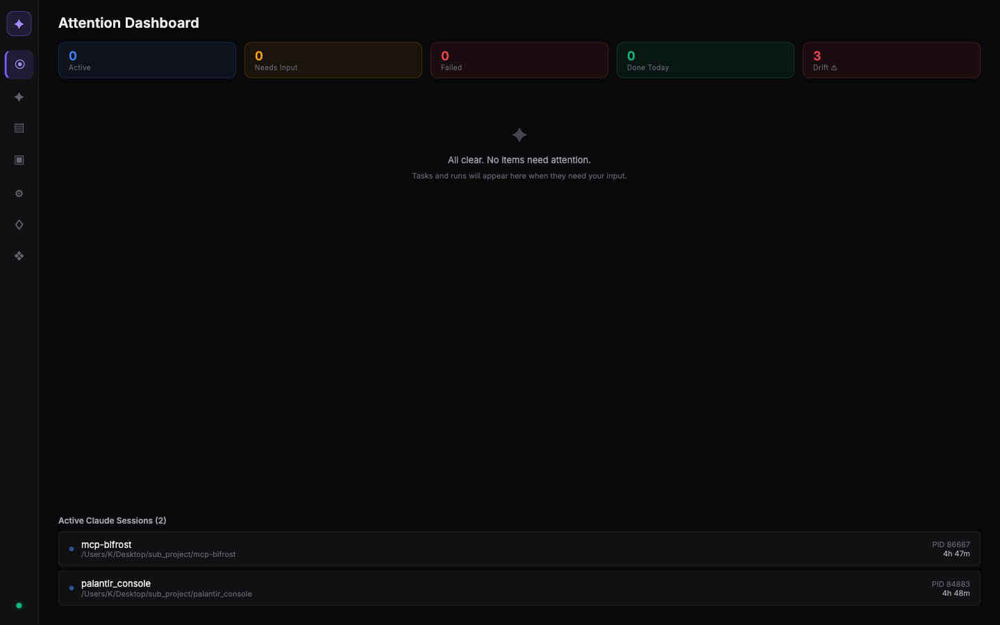
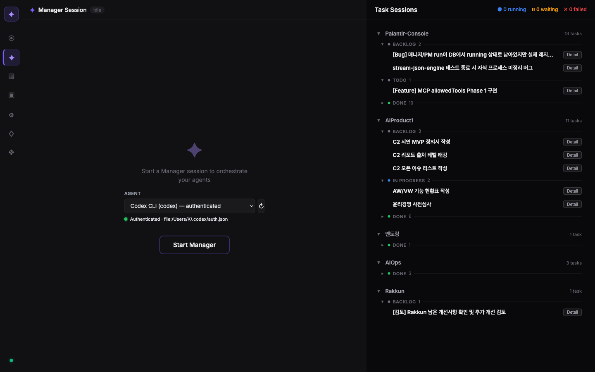
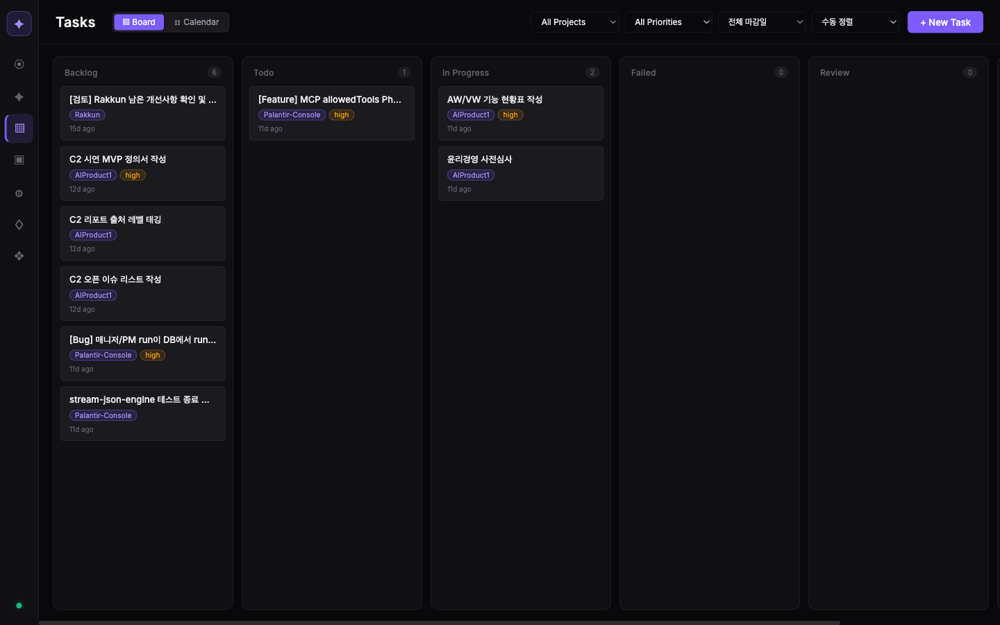
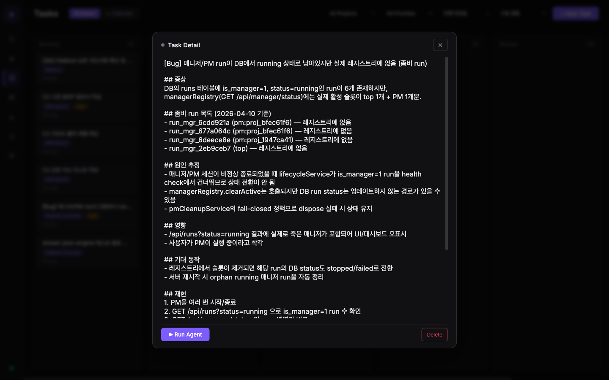
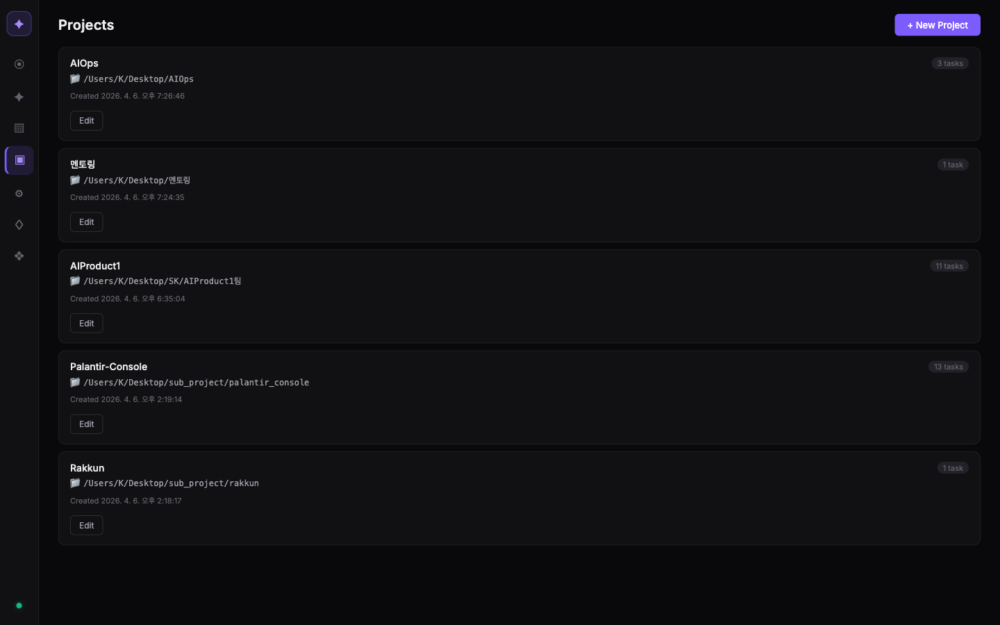
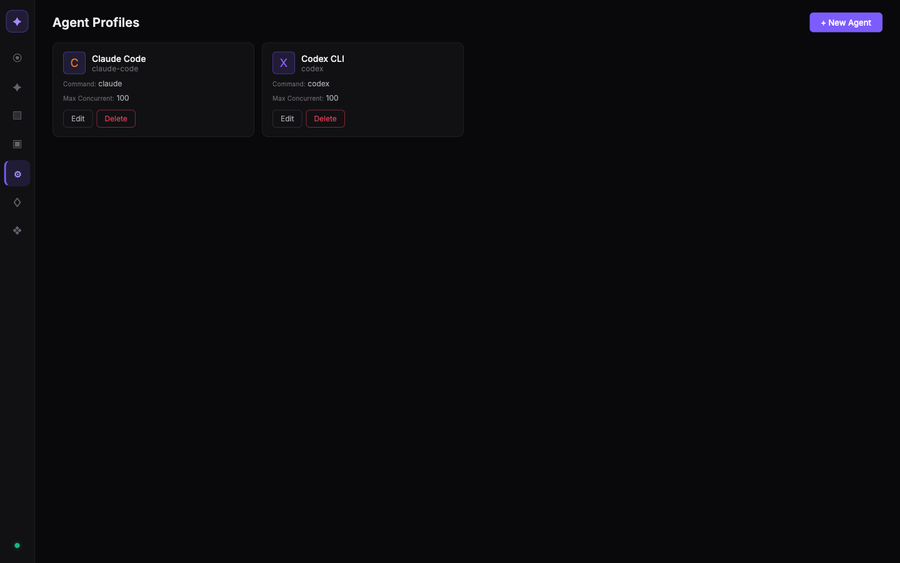
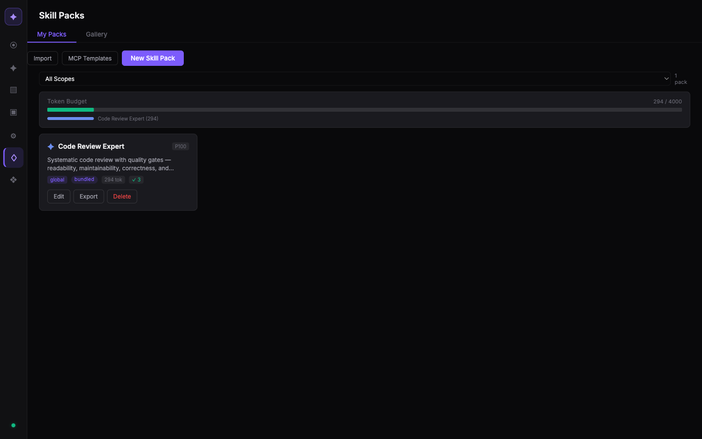

# Palantir Console — 팀 소개 자료

> **한 줄 요약**: AI 코딩 에이전트(Claude Code, Codex)를 **3계층 (Main Manager → PM → Worker)** 으로 묶어 운영하는 로컬 관제 허브.

여러 프로젝트에 걸쳐 AI 에이전트를 병렬로 돌리다 보면, 누가 뭘 하고 있는지, 무엇이 멈췄는지, 뭐가 끝났는지 추적이 안 된다. Palantir Console 은 이 문제를 풀기 위해 만든 **싱글 사용자용 개인 관제탑**이다. `localhost:4177` 웹 UI 한 곳에서 여러 프로젝트의 태스크 · 에이전트 · 대화를 모두 본다.

```
Main Manager (Top)                       ← 전체 프로젝트/PM 총괄
 ├── PM (Project A)  ← project_brief + conventions 주입됨
 │    ├── Worker 1   ← 독립 git worktree 에서 격리 실행
 │    ├── Worker 2
 │    └── Worker 3
 ├── PM (Project B)
 └── PM (Project C)
```

---

## 1. 무엇을 풀려고 만들었나

| 기존 문제 | Palantir Console 의 답 |
|---|---|
| Claude/Codex 를 프로젝트마다 터미널 열어서 돌리다 보면 대화 맥락이 파편화된다 | 각 프로젝트에 **PM** 하나를 lazy-spawn 하고, 해당 PM 이 그 프로젝트 맥락을 유지 |
| 워커들이 서로 같은 파일을 건드려서 conflict | 모든 Worker 는 **git worktree** 로 파일시스템 격리 |
| "그 작업 끝났나?" 를 CLI 돌아가며 확인 | Dashboard 에서 **Needs Input / Failed / Running / Review** 가 한눈에 |
| PM 이 "끝냈다" 라고 말하는데 실제 DB 는 다른 경우 | **Dispatch Audit** — PM claim 을 DB truth 와 대조, 어긋나면 Drift 배지 (annotate-only, block 은 안 함) |
| Manager CLI 세션이 매번 cold start | Claude 는 `--resume`, Codex 는 `exec resume <thread_id>` 로 부팅 시 자동 복구 |

---

## 2. 주요 기능 투어

### 2.1 Dashboard — "지금 뭘 봐야 하나"



상단 5개 카드가 **주의 지표** 로 고정:
- **Active** — 지금 실행 중인 에이전트 수
- **Needs Input** — 에이전트가 사용자 응답을 기다리는 중 (최우선)
- **Failed** — 실패한 Run (재시도 가능)
- **Done Today** — 오늘 완료된 Run
- **Drift ⚠** — PM 이 DB 와 어긋난 주장을 기록했을 때. 클릭하면 좌우 diff drawer 가 열림

아래는 **Triage Feed** (우선순위 순). 모든 거 조용하면 "All clear." 가 뜬다. 맨 아래 **Active Claude Sessions** 는 현재 호스트에서 돌고 있는 Claude Code 프로세스 모두 — 이 콘솔과 무관하게 터미널에서 띄운 것까지 포함.

### 2.2 Manager — 에이전트 오케스트레이터



40/60 분할 레이아웃:
- **왼쪽 40%**: Top Manager 채팅. 에이전트 드롭다운에서 Claude Code 또는 Codex CLI 선택 후 **Start Manager**.
- **오른쪽 60%**: Task Sessions 그리드. 프로젝트별로 BACKLOG / TODO / IN PROGRESS / DONE 이 접이식으로 정리되어, Manager 와 대화하면서 동시에 현재 상황을 확인 가능.

Manager 에게 "Palantir-Console 프로젝트의 버그 잡아줘" 라고 말하면:
1. Router 가 `@Palantir-Console 메시지` 또는 프로젝트명 매칭으로 해당 **PM 에게 라우팅**
2. PM 이 없으면 lazy-spawn (Codex thread 시작 + project_brief 을 system prompt 에 bake)
3. PM 이 필요하다 판단하면 Worker 를 spawn

**Conversation target 드롭다운** 으로 Top 대신 특정 PM 과 직접 대화하는 것도 가능. `Reset PM` 은 해당 PM 의 thread 를 끊고 다음 메시지부터 새 thread 로.

### 2.3 Task Board — 칸반 보드



`Backlog → Todo → In Progress → Review → Done` 5컬럼. Todo → In Progress 로 드래그하면 **에이전트 실행 모달** 이 열려서 어떤 에이전트 프로필로 돌릴지, 어떤 프롬프트를 줄지 결정한다.

필터/정렬 조합:
- 프로젝트 / 우선순위 / 마감일 필터
- 수동 정렬 / 마감일순 / 우선순위순
- Calendar 탭 으로 전환하면 캘린더 뷰

### 2.4 Task Detail — 상세 패널



카드 클릭 시 상세 모달. 제목/설명/Status/Priority/Project 를 inline edit 하고, `▶ Run Agent` 로 즉석 실행. 같은 Task 에 여러 Run 이 붙을 수 있어 이력이 축적된다.

### 2.5 Projects — 프로젝트 목록



각 프로젝트는:
- 물리 디렉토리 경로
- `pm_enabled` — PM 자동 spawn 허용 여부
- `preferred_pm_adapter` — codex / claude 선호
- **project_brief** — conventions + known_pitfalls. 이 텍스트가 PM 의 static system prompt 에 주입되어 `cached_input_tokens` 로 비용을 낮춘다.

### 2.6 Agents — 에이전트 프로필



기본 2개 (Claude Code, Codex CLI) + 커스텀 추가 가능. 각 프로필은 실행 명령어, `max_concurrent`, `capabilities_json`, `env_allowlist` 를 가져서 Manager 의 dispatch 추론과 lifecycle 동시성 게이트에 연결된다. 보안: allowlist 된 명령어만 실행 가능.

### 2.7 Skill Packs — MCP 템플릿 / 스킬 번들



MCP 서버 템플릿 + 시스템 프롬프트 스니펫을 **재사용 가능한 팩** 으로 묶는다. 예: `Code Review Expert` 팩은 체크리스트 + MCP tool refs 를 한 번에 mount. 프로젝트 / 태스크 / run 레벨에 바인딩 가능하고, Run 시작 시 스냅샷이 frozen 되어 나중에 drift 감사 가능.

### 2.8 Run Inspector — 실행 상세

Run 을 클릭하면 열리는 패널:
- **Status** — running / needs_input / completed / failed
- **Events** — SSE 로 실시간 상태 전환 이력
- **Send Input** — `needs_input` 상태일 때 에이전트에게 텍스트 전달 (자동으로 parent 에 staleness notice 큐잉)
- **Cancel** — 실행 중 취소
- **Preset Drift 감사** — frozen snapshot vs 현재 preset 의 diff

---

## 3. 핵심 개념 요약

| 개념 | 역할 |
|---|---|
| **Main Manager (Top)** | 최상위 관제자. 전 프로젝트와 PM 총괄 |
| **PM** | 프로젝트별 관리자. 첫 메시지 시 lazy-spawn, 해당 프로젝트의 workers 조율 |
| **Worker** | 실제 코딩하는 AI 에이전트. 독립 git worktree 에서 격리 실행 |
| **Project** | 작업 묶음 (디렉토리 하나 = 프로젝트 하나가 보통) |
| **Task** | 구체 할 일. 칸반으로 관리 |
| **Run** | Task 에 대해 에이전트를 한 번 실행한 기록. 하나의 Task 에 여러 Run |
| **Agent Profile** | 실행할 CLI 설정 (Claude Code / Codex / OpenCode / 커스텀) |
| **Worker Preset** | Agent + MCP servers + 시스템 프롬프트 번들 |
| **Skill Pack** | MCP 템플릿 + 체크리스트 + 프롬프트 snippets |
| **Conversation** | 1급 식별자: `top`, `pm:<projectId>`, `worker:<runId>` |
| **Dispatch Audit** | PM 이 definitive claim 할 때마다 DB truth 와 대조하는 annotate-only 감사 |

---

## 4. 내가 실제로 일하는 방식

### 4.1 자율 모드 (autonomous default ON)

이 repo 에서는 AI 가 **기본적으로 자율 진행**. 매 단계 확인받는 대신 phase 종료 시점에만 요약 보고한다.

**승인 없이 자동 진행**:
- codex 교차검증 PASS + 테스트 그린 PR 의 squash merge + branch 삭제 + main pull
- 테스트 찌꺼기 / gitignore / 문서 등 보조 작업 즉시 정리
- smoke 레벨 자동 승격 (레벨 1 PASS → 레벨 2)
- codex 라운드 반복, 블로커 자동 수정

**여전히 확인 필요**:
- 되돌리기 불가한 git (force push, 원격 브랜치 삭제, published commit amend)
- 사용자가 띄운 prod 서버 kill
- spec / lock-in / 원칙 재해석이 필요한 설계 결정
- codex 가 5라운드 이상 수렴 안 될 때 (설계 전제 오류 가능성)

### 4.2 Phase 기반 표준 작업 체인

```
branch 만들기
  ↓
구현
  ↓
npm test
  ↓
codex 교차검증  ←─┐
  ↓              │ (블로커 나오면 수정 후 재검증)
  PASS? ─── NO ──┘
  ↓ YES
commit
  ↓
PR 생성
  ↓
(자동) squash merge + 브랜치 삭제 + main pull
  ↓
다음 phase 진입 여부 보고
```

세부 규칙: `.claude/memory/feedback_phase_workflow.md`.

### 4.3 PM 경유 위임 원칙

**Main Manager 가 Worker 를 직접 spawn 하지 않는다.** 항상 PM 을 거쳐 작업을 내린다. 이유:
- PM 이 프로젝트 brief/conventions 를 가지고 있어, 같은 지시도 해당 프로젝트 컨텍스트에서 해석
- 여러 프로젝트가 병렬로 돌아도 PM 별로 conversation 이 분리되어 교차오염 없음
- Dispatch audit 이 "누가 누구한테 뭘 시켰는지" 를 PM 단위로 기록

**태스크 재사용**: 관련 Task 가 이미 보드에 있으면 새로 만들지 말고 그 Task 에서 `Run Agent`. 하나의 Task 에 여러 Run 이 쌓이면서 이력이 보존된다.

**프로젝트 미지정 태스크**: 관련 프로젝트가 없으면 `project_id` 를 아예 생략 (임의로 "기본 프로젝트" 붙이지 않음).

### 4.4 실제 시나리오 예시

> **상황**: Palantir-Console 에서 "좀비 run" 버그를 잡고 싶다.

1. **Board 에서 기존 Task 확인** — `[Bug] 매니저/PM run이 DB에서 running 상태로 남아있지만 실제 레지스트리에 없음` 카드가 이미 Backlog 에 있음 → 재사용.
2. **Task Detail → Run Agent** → agent=Codex CLI, prompt="이 증상 재현 후 근본 원인 분석 + 수정" → Backlog 에서 **In Progress** 로 자동 이동.
3. Worker 가 독립 worktree 에서 재현 → 수정 → 테스트 → commit → PR 생성까지 자동.
4. **Dashboard** 에 Needs Input 뜨면 (예: "이 접근으로 가도 되냐?") Triage Feed 에서 바로 Respond.
5. Worker 가 끝나면 Task 자동으로 **Review** 로 이동.
6. PR 리뷰 → codex 교차검증 → PASS 면 자율 merge → main pull → Task **Done**.

이 전 과정에서 내가 한 것: **Task 카드 클릭 + 프롬프트 한 줄 + needs_input 응답 1~2번 + 최종 PR 훑어보기.** 나머지는 Palantir Console 이 조율.

---

## 5. 아키텍처 포인트 (간단히)

- **Backend**: Express 5 + SQLite (better-sqlite3, WAL) + EventEmitter 기반 SSE
- **Frontend**: Preact + HTM (CDN 없이 vendor/ 자체 번들) + self-hosted Inter — **빌드 스텝 없음** (`server/public/` 파일이 그대로 서빙)
- **Worker 실행**: tmux 세션 (있으면) 또는 subprocess, git worktree 로 격리
- **Manager 프로토콜**:
  - Claude Code: `--print --output-format stream-json --input-format stream-json` (persistent multi-turn)
  - Codex: `codex exec --json` 첫 turn → `codex exec resume <thread_id>` (stateless + thread resume)
- **실시간**: SSE + `Last-Event-ID` 재생. 시맨틱 envelope (`from_status`, `to_status`, `reason`, `task_id`, `project_id`) 로 상태 전환 이벤트 발행

보안 요약:
- 기본 `127.0.0.1` 바인딩, `PALANTIR_TOKEN` 있으면 `0.0.0.0` 승격 (브라우저는 HttpOnly 쿠키 인증)
- 에이전트 명령어 allowlist, tmux 내 shell injection 방지
- `.claude-auth.json` (mode 0600, gitignored) 로 OAuth 토큰 보관
- SSRF 방어 (Skill Pack URL install 경유)

---

## 6. 바로 써보기

```bash
cd palantir_console
npm install
npm start
open http://localhost:4177
```

또는 자동 환경 설정 (nvm/volta/fnm 자동 감지):
```bash
bash setup.sh
npm start
```

최초 접속:
1. `#projects` 에서 **+ New Project** 로 프로젝트 1개 등록 (디렉토리 경로만 있으면 됨)
2. `#board` 에서 **+ New Task** 로 할 일 카드 1개 생성
3. `#manager` 에서 **Start Manager** → 에이전트 프로필 선택 → 채팅에 `@<프로젝트명> 이거 해줘`

> 자세한 API, 환경변수, 보안 정책, 개발 가이드는 [`README.ko.md`](../../README.ko.md) 와 [`CLAUDE.md`](../../CLAUDE.md) 참고.

---

## 7. 참고 문서

| 문서 | 내용 |
|---|---|
| [`README.ko.md`](../../README.ko.md) | 전체 기능 + API 레퍼런스 |
| [`CLAUDE.md`](../../CLAUDE.md) | 아키텍처, 자율 모드 작업 스타일, 주의 사항 |
| [`docs/specs/manager-v3-multilayer.md`](../specs/manager-v3-multilayer.md) | v3 3계층 재설계 스펙 (lock-in + phase 역사) |
| [`docs/backlog.md`](../backlog.md) | 현재 남은 작업 (Ready / Data-wait / Trigger-wait / Draft-review) |
| [`docs/test-scenarios.md`](../test-scenarios.md) | QA 시나리오 |
